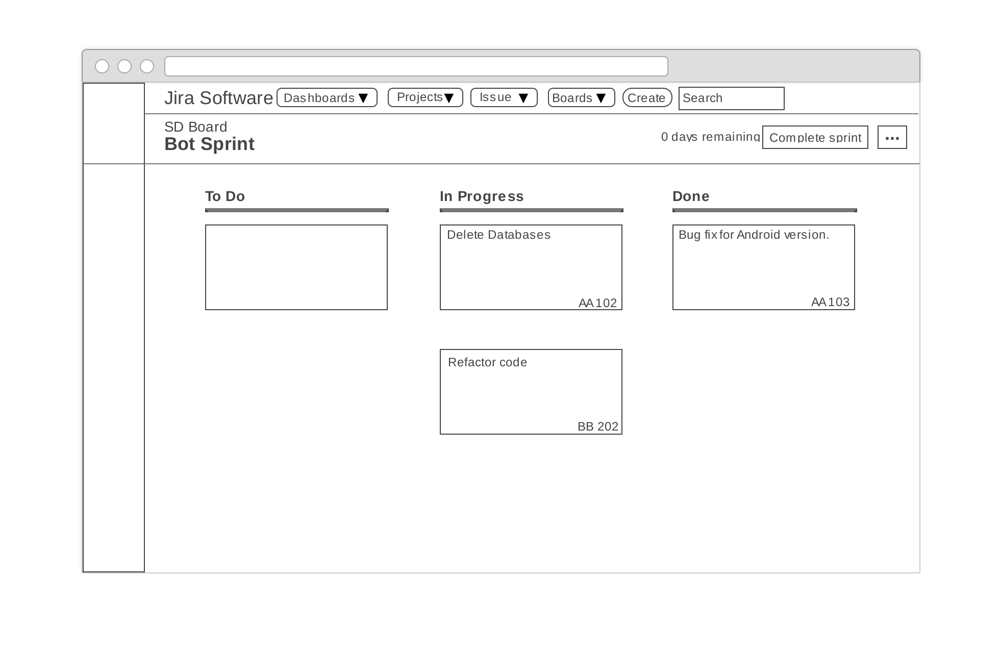
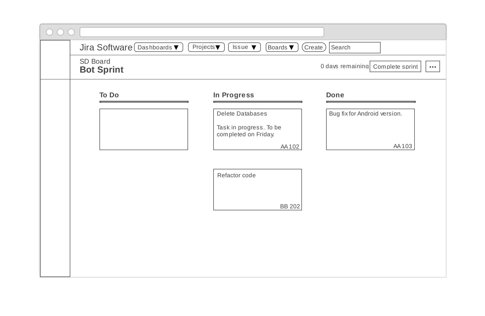
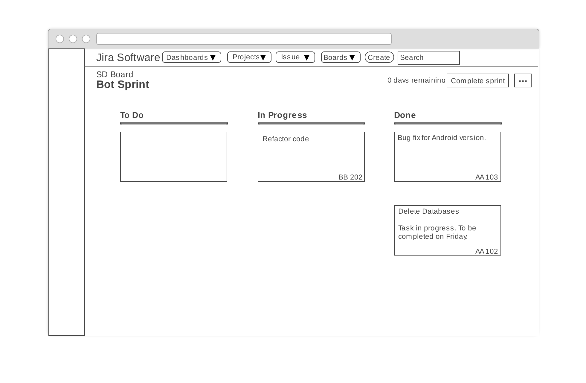
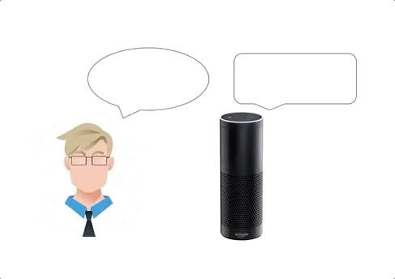
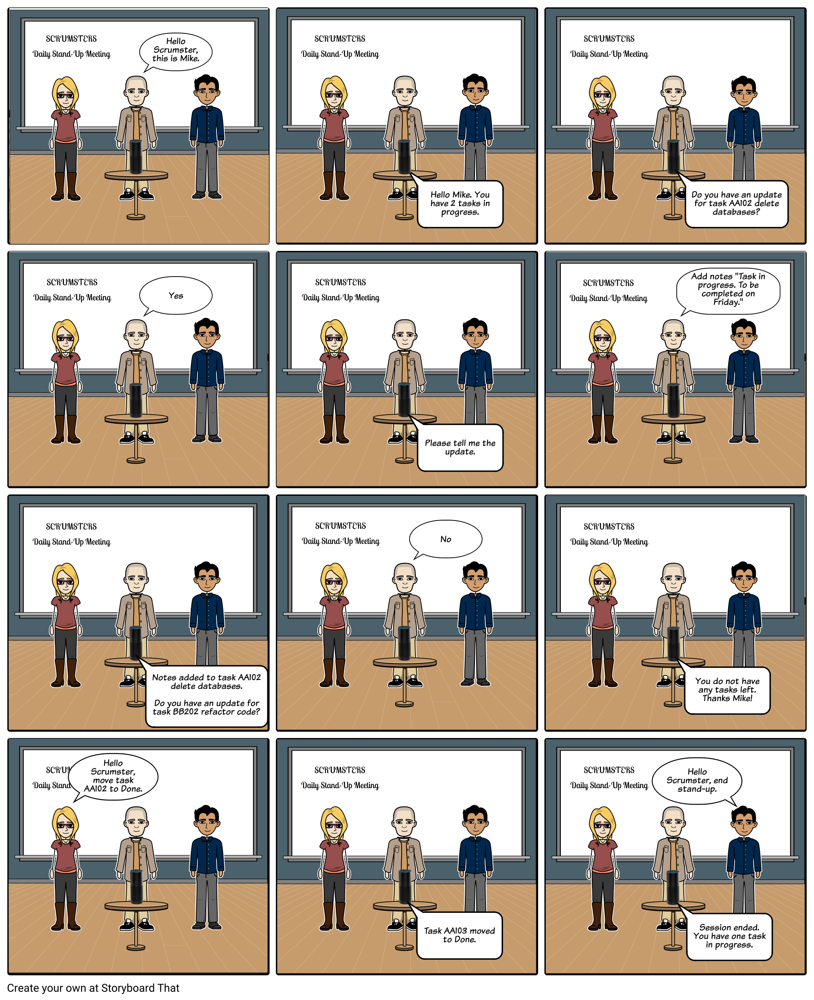
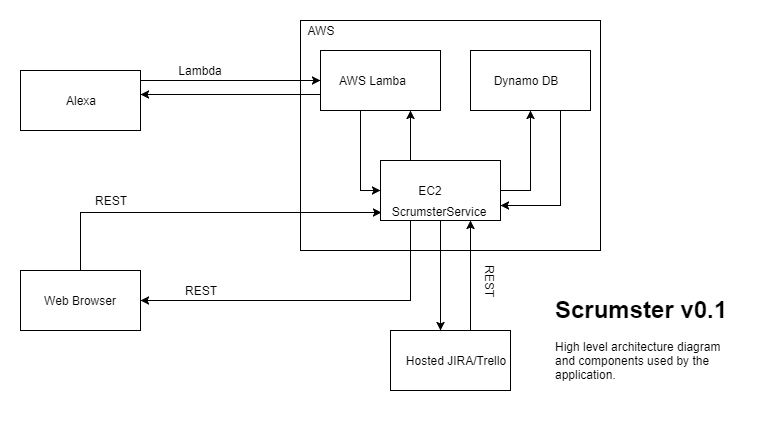

## DESIGN MILESTONE

## Problem Statement

Scrum is a subset of the Agile methodology in software development and it is extensively used today in organizations, big and small. It is known to increase productivity and it modularizes development in cycles of work called Sprints. A Sprint is usually 2-4 weeks long and is conducted using tools such as JIRA or Trello. As a part of scrum, the team conducts daily meetings called "stand-ups" to take updates from team members, and the scrum master conducts and manages these meetings throughout the course of the sprint. There are 3 roles as part of Scrum - Product Owner, Team and ScrumMaster. The ScrumMaster acts as the advocate for Scrum, and helps the team learn and apply Scrum to achieve business value. 

Since a lot of meetings take place in Scrum and there are multiple teams within an organization, a lot of manual time and effort goes into this process. The organization also has to invest in hiring and training a professional ScrumMaster. We believe that this is a problem worth solving and we intend to solve it by developing a Bot named 'Scrumster' that will be perform some of the tasks necessary to co-ordinate and manage a Scrum team. Many of the tasks will be automated such as updating tasks on the JIRA board or collecting updates from Engineers, making the Scrum process much more effective and easier to adopt. Any attempt to ease the adoption of Scrum is something worth pursuing as many organizations find the transition to Scrum a cumbersome task. With this bot, the effort put in by the ScrumMaster as well as the Team members will be significantly reduced and the Scrum process will be much more streamlined.

## Bot Description

Scrumster is a Bot designed to serve as an advocate of Scrum . The end goal would be to replace one of the existing Scrum roles (ScrumMaster in particular), but at the level of implemetation we are focusing on, we would want the bot to be a catalyst for the overall Scrum process within teams in an organization. Most of us who have experience working in Scrum teams find it to be a laborious task, to update Kanban boards and add details to these updates. This is one of the problems Scrumster looks to solve by automating the process of updating tasks by having a simple voice interaction through an Alexa application, with the Engineers during the stand-up to update tasks pertaining to the sprint. At the back end, it is tied to JIRA/Trello APIs to acheive this task.

In addition to collecting information regarding a particular task, it also assists in moving tasks from one state to another (for eg. from 'In-progess' to 'Completed') which further eases the life of an engineer. Lastly, Scrumster also provides the functionality of summarizing the sprint up to that point and providing feedback as to whether the sprint is on track or not. 

## Use Cases

1. Use Case - 1

```
Use Case: Collect updates from team members and update the JIRA board  
1 Preconditions
   User must have access to the Scumster Bot and his/her name listed as member of the JIRA Scrum team. If absent for a particular stand-up, updates have to be supplied prior to meeting in the Application.
2 Main Flow
   User initiates meeting with Bot by introducing him/herself. Bot starts by looking for each member's name on the Team list [S1]. It then checks if the member is present or absent in the scheduled meeting [S2]. If present Scrumster will tell the member the tasks assigned to him/her [S3]. User shall give updates on each listed task [S4]. If the team member is absent or on PTO, the Scrumster Bot shall already have this information collected through the centralized portal [E1].
3 Subflows
  [S1] Bot checks for all members on the team having access to the JIRA board.
  [S2] Bot checks if the member is present or absent.
  [S3] Bot lists down the tasks for the particular member.
  [S4] User has to give his/her updates for the listed tasks by the Bot.
4 Alternative Flows
  [E1] Team member is absent for the meeting.
```

2. Use Case - 2
  
  ```
  
Use Case: Move tasks from one state to another.
1 Preconditions
     User must have access to the Scumster Bot and his/her name must be listed as members of the JIRA Scrum team. 
2 Main Flow
     After updates are collected by the Scrumster Bot, the Bot will check for completed tasks [S1]. The completed tasks are moved from the 'In-progress' column to the `Completed` column on the board [S2]. If no tasks are completed yet, no change is made to the board [E1].
3 Subflows
    [S1] Bot checks for completed tasks after collecting updates from member.
    [S2] Bot will move the completed tasks to 'Done' board.
4 Alternative Flows
    [E1] No tasks make transition from one state to the other in the collected updates.
  
  ```
  
3. Use Case - 3

```
Use Case: Sprint Summary and Feedback 
1 Preconditions
   Scrumster Bot should have finished with all the team members' updates.
2 Main Flow
   At the end of the meeting, Scrum Bot will analyze the Scrum Board and talk about the progress of the team. Bot will review performance of the team and see if target will be met or not. 
3 Subflows
  [S1] Bot checks if all members on the team have finished with their updates or not.
  [S2] Bot will analyze the Scrum board(JIRA/Trello) for number of tasks completed before due date and number of tasks still in progress after due date has expired.
  [S3] Talk about overall performance of the team and how far the team is from the goal.
  
```


## Design Sketches

__Wireframes__  
We have created a wireframe mockup showing the result of adding a note to an existing task and moving a task from 'In Progress' to 'Done'.

* This is the initial state of the Agile board.


* We will now see the results for two different requests.
   * A user request to Scrumster to add a note to a task.
   
   
   * A user request to Scrumster to move a task from 'In Progress' to 'Done'.
   
  
To provide an idea of how these requests are made, we show a simulation of a sample conversation of a user with Scrumster via Alexa (the GIF is approximately 11 seconds long. Please do not assume there is an issue if you do not see any change for a few seconds).



__Storyboard__  
Our storyboard is a sequence of illustrations that provide an understanding of how our bot, Scrumster, will take voice inputs from the user via Alexa and make changes to a JIRA Agile board. We have provided two scenarios.
1. A user providing an update to an exisiting task.
2. A user moving a task from 'In Progress' to 'Done'.




## Architecture Design


The Architecture consists of essentially 3 components. The Alexa application or a simulator, which can be invoked using Lambda functions that amazon provides, a central platform hosted on a cloud provider like AWS which would be developed to act as the repository for all the activties that Scrumster carries out, and a hosted JIRA/Trello service.

The Alexa application acts as the interaction medium between Human and bot , to collect the voice input from the Engineer and give voice feedback regarding the Scrum. The Central platfrom hosted on AWS would be linked to both the Alexa application and the JIRA page. Its main purpose is to queue the requests being made to JIRA, to run as a background task to contain the latency experienced at the Alexa voice interface. This reduction in latency would ensure a better User Experience, thereby making the 'stand-up' portion of the functionality more real-time. The central platform can also be used to provide a dashboard for statistics, which would be made available to the person monitoring Scrum progress. 

A hosted JIRA/Trello service is used, as opposed to setting up a server and maintaining it ourselves. This is a design option made to simplify infrastructure maintanence and focus on realizing Bot functionality. The requests made at the Alexa application would translate into JIRA/Trello API calls to realize functionality as defined by our use cases.

__Design Patterns__
* **Event driven programming**: A programming paradaign where flow of programs is determined by the events. In our application, the user starts the Scrumster service and issues a request when prompted by the service. To achieve this efficiently we are using AWS Lambda which is a event driven serverless computing platform provided by Amazon.

```javascript
'use strict';

const Alexa = require('alexa-sdk');

const APP_ID = '';  
const HELP_MESSAGE = 'Welcome to Scrumster help';
const STOP_MESSAGE = 'Thanks for using Scrumster';

const handlers = {
    'LaunchRequest': function () {
        this.emit('Start');
    },

    'Start': function () {

        // Create speech output
        this.emit(':tellWithCard', speechOutput, 'Welcome,', 'Scrumster has started');
    },
    'AMAZON.HelpIntent': function () {
        const speechOutput = this.t('HELP_MESSAGE');
        const reprompt = this.t('HELP_MESSAGE');
        this.emit(':ask', speechOutput, reprompt);
    },
    'AMAZON.CancelIntent': function () {
        this.emit(':tell', this.t('STOP_MESSAGE'));
    },
    'AMAZON.StopIntent': function () {
        this.emit(':tell', this.t('STOP_MESSAGE'));
    },
};

exports.handler = function (event, context) {
    const alexa = Alexa.handler(event, context);
    alexa.APP_ID = APP_ID;
    // To enable string internationalization (i18n) features, set a resources object.
    alexa.registerHandlers(handlers);
    alexa.execute();
};
```
The above code is the AWS Lambda function for the Scrumster service (an Amazon Alexa skill). The application executes the 'Start' function at launch, achieved by calling Alexa via voice. This is a skeleton structure that will be updated with additional functions.

* **REST API**: We are integrating the Scrumster service (Amazon Alexa skill) with JIRA API allowing users to make requests by invoking the Scrumster service using Amazon Alexa.

__Constraints or Guidlines__
* **User identification**: Restriction in Amazon Alexa functionality prevents a user voice from being identified uniquely. This forces users to provide unique identification.
* **No trace**: Due to lack of user identification, users are able to make modifications to other users tasks without any trace.
